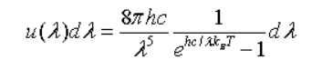
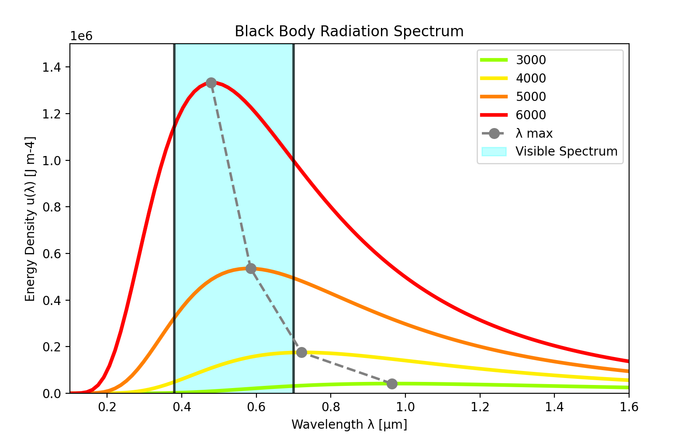

# Planck's Curve

This is a python program which shows you the graph of wavelength versus energy density of a black body using Planck's Law. Using the power of the matplotlib library you can understand the black body radiation spectrum.

## What is Planck's Law

Planck's law describes the energy density of electromagnetic radiation emitted by a black body in thermal equilibrium at a given temperature T, when there is no net flow of matter or energy between the body and its environment.

Every physical body spontaneously and continuously emits electromagnetic radiation and the energy density of a body, U, describes the energy per unit area, for particular radiation wavelengths. The relationship given by Planck's radiation law, given below, shows that with increasing temperature, the total radiated energy of a body increases and the peak of the emitted spectrum shifts to shorter wavelengths.According to this, the energy density of a body for wavelngth lambda at absolute temperature T is given by

## Graph

This is the graph obtained after running the program.

## Built With

* [Pycharm](https://www.jetbrains.com/pycharm/) - IDE used

## Authors

* **Tanush R** - [tanush-r](https://github.com/tanush-r)

